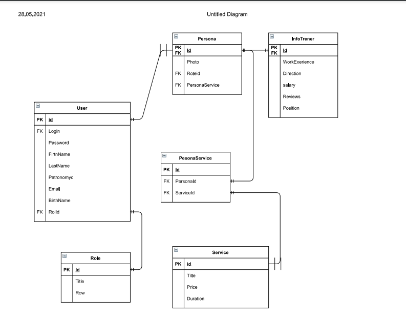

<table style="width: 100%;">
  <tr>
    <td style="text-align: center; border: none;"> 
        Министерство образования и науки РФ <br/>
        ГБПОУ РМЭ "Йошкар-Олинский Технологический колледж 
    </td>
  </tr>
  <tr>
    <td style="text-align: center; border: none; height: 45em;">
        <h2>
            Курсовой проект <br/>
            "Проектирование и разработка информационных систем" <br/>
            для группы И-31
        <h2>
    </td>
  </tr>
  <tr>
    <td style="text-align: right; border: none; height: 20em;">
        <div style="float: right;" align="left">
            <b>Разработал</b>: <br/>
            Михайлов Максим Алексеевич <br/>
            <b>Проверил</b>: <br/>
            Колесников Евгений Иванович
        </div>
    </td>
  </tr>
  <tr>
    <td style="text-align: center; border: none; height: 1em;">
        г.Йошкар-Ола, 2021
    </td>
  </tr>
</table>

<div style="page-break-after: always;"></div>

https://github.com/MaksimMih/Kurs_job

# Содержание

* [Теоретическая часть](#Теоретическая-часть)
* [Практическая часть, разработка бд](#Практическая-часть.-Разработка-БД)
* [Практическая часть, разработка кода ИС](#Практическая-часть.-Разработка-кода-ИС)

# Теоретическая-часть
## Диаграммы

### Предметная область Интернет провайдер.Подсистема работы с товарами.

### Диаграмма Use Case:


### Диаграмма ER:

### Диаграмма Состояний:

### CСпецификация прецентдентов Use Case:


# Практическая часть
## Программирование С#

### Приложение было разработанно в Visual Studio, пример работы программы:
### Главное окно:

#### Прмер кода разметки страницы:
```xml
<Window x:Class="WpfApp1.windows.ShowUser"
        xmlns="http://schemas.microsoft.com/winfx/2006/xaml/presentation"
        xmlns:x="http://schemas.microsoft.com/winfx/2006/xaml"
        xmlns:d="http://schemas.microsoft.com/expression/blend/2008"
        xmlns:mc="http://schemas.openxmlformats.org/markup-compatibility/2006"
        xmlns:local="clr-namespace:WpfApp1.windows"
        mc:Ignorable="d"
        Title="ShowUser" Height="450" Width="1000">
    <Window.Resources>
        <Style TargetType="Button">
            <Setter Property="Background" Value="LightGray"/>
            <Setter Property="BorderBrush"  Value="DarkGray"/>
            <Setter Property="FontFamily"  Value="Segoe Black"/>
            <Setter Property="Foreground"  Value="Black"/>
            
            
            
        </Style>
    </Window.Resources>
    <Grid>
        <Grid.ColumnDefinitions>
            <ColumnDefinition Width="150"/>
            <ColumnDefinition Width="*"/>
        </Grid.ColumnDefinitions>
        
        <StackPanel Grid.Column="0"
                    VerticalAlignment="Bottom">
            <Button Content="Добавить"
                    x:Name="AddService"
                   
                Click="AddService_Click"></Button>
            <Button Content="Посмотреть услуги"
                    x:Name="ServiceShow"
                    Margin="0 0 0 0"
                    Click="ServiceShow_Click"
                   ></Button>
            <Button Content="Выход"
                    x:Name="ExitButton"
                    Margin="0 0 0 10"
                   Click="ExitButton_Click"></Button>
           
           

        </StackPanel>


        <Grid Grid.Column="1">
            <Grid.RowDefinitions>
                <RowDefinition Height="30"/>
                <RowDefinition Height="1*"/>
                <RowDefinition Height="30"/>
            </Grid.RowDefinitions>
            <StackPanel 
    Orientation="Horizontal" 
    VerticalAlignment="Center"
                Grid.Row="0">
                <Label Content="Цена: "/>
                <RadioButton 
        GroupName="Price"
        Tag="1"
        Content="по возрастанию" 
        IsChecked="True" 
        Checked="RadioButton_Checked"
        VerticalContentAlignment="Center"/>
                <RadioButton 
        GroupName="Price" 
        Tag="2"
        Content="по убыванию" 
        Checked="RadioButton_Checked"
        VerticalContentAlignment="Center"/>
                <Label Content="Фильтр по скидке: "
                     Margin="10,0,0,0"
                        VerticalAlignment="Center"/>
                <ComboBox
                     Name="DiscountFilterComboBox"
                        SelectedIndex="0"
                        SelectionChanged="DiscountFilterComboBox_SelectionChanged"
                         ItemsSource="{Binding FilterByDiscountNamesList}"/>
                <Label Content="Поиск"/>
                <TextBox
                    x:Name="SearchFilterTextBox"
                    Width="250"
                    KeyUp="TextBox_KeyUp"
                    VerticalAlignment="Center"
                    />
            </StackPanel>
            
            
            
            
            
            <ListView 
            Grid.Column="1"
            Grid.Row="1"
            ItemsSource="{Binding UserService}"
            x:Name="ProductListView">
                
                <ListView.ItemTemplate>
                    
                
                <DataTemplate>
                        <!-- рисуем вокруг элемента границу с загругленными углами -->
                        <Border 
                BorderThickness="1" 
                BorderBrush="Black" 
                CornerRadius="5">
                            <!-- основная "сетка" из 3-х столбцов: картинка, содержимое, цена -->
                            <Grid 
                    Margin="10" 
                    HorizontalAlignment="Stretch">
                                <Grid.ColumnDefinitions>
                                    <ColumnDefinition Width="64"/>
                                    <ColumnDefinition Width="*"/>
                                    <ColumnDefinition Width="100"/>
                                </Grid.ColumnDefinitions>


                                <Image
                        Width="64" 
                        Height="64"
                        Source="{Binding Path=ImagePreview}" />
                               
                                    <Button HorizontalAlignment="Right" Margin="0 0 50 0" Height="30"  x:Name="DeleteButton" Click="DeleteButton_Click" Width="50" Content="Удалить" Grid.Column="1"></Button>
                                <Button  HorizontalAlignment="Right"   Margin="0 0 0 0" Height="30" Width="50" Content="Редактировать" Grid.Column="1" x:Name="EditButton" Click="EditButton_Click"> </Button>
                                
                                <TextBlock 
                        Text="{Binding Salary}" 
                        Grid.Column="2" 
                        HorizontalAlignment="Right" 
                        Margin="10"/>
                               

                                <!-- для содержимого рисуем вложенную сетку -->
                                <Grid Grid.Column="1" Margin="5">
                                    <Grid.RowDefinitions>
                                        <RowDefinition Height="20"/>
                                        <RowDefinition Height="20"/>
                                        <RowDefinition Height="*"/>
                                    </Grid.RowDefinitions>

                                    <StackPanel
                            Orientation="Horizontal">
                                        <TextBlock 
                                Text="{Binding Users }"/>
                                        <TextBlock 
                                Text=" | "/>
                                        <TextBlock 
                                Text="{Binding Role.Title}"/>
                                    </StackPanel>

                                    <TextBlock 
                            Text="{Binding Achievements}" 
                            Grid.Row="1"/>
                                    <TextBlock 
                            Text="{Binding Education}" 
                            Grid.Row="2"/>
                                </Grid>

                            </Grid>
                        </Border>
                    </DataTemplate>

                </ListView.ItemTemplate>
                <ListView.ItemContainerStyle>
                    <Style 
            TargetType="ListViewItem">
                        <Style.Triggers>
                            <DataTrigger
                            Binding="{Binding MinSalary}"
                            Value="True">
                                <Setter
                                Property="Background"
                                Value="Khaki"/>
                            </DataTrigger>
                        </Style.Triggers>
                        <Setter 
                Property="HorizontalContentAlignment"
                Value="Stretch" />
                    </Style>
                </ListView.ItemContainerStyle>
            </ListView>
            <StackPanel Grid.Row="2" Orientation="Horizontal">
                <Label Content="{Binding FilteredServicesCount}"></Label>
                <Label >/</Label>
                <Label Content="{Binding ServicesCount}"/>
            </StackPanel>
        </Grid>

    </Grid>
</Window>
```
#### Пример Логики главной страницы:

```cs
namespace WpfApp1.windows
{
    /// <summary>
    /// Логика взаимодействия для ShowUser.xaml
    /// </summary>
    public partial class ShowUser : Window, INotifyPropertyChanged
    {
        public event PropertyChangedEventHandler PropertyChanged;

        private List<Userman> _UserService;

        public List<Userman> UserService
        {
            get
            {
               

                var FilteredServiceList = _UserService.FindAll(item =>
                   item.DiscountFloat >= CurrentDiscountFilter.Item1 &&
                     item.DiscountFloat < CurrentDiscountFilter.Item2
                     && item.Role.id ==6);

                if (SearchFilter != "")
                    FilteredServiceList = FilteredServiceList.Where(item =>
                        item.Users.IndexOf(SearchFilter, StringComparison.OrdinalIgnoreCase) != -1 ).ToList();


                if (SortPriceAscending)
                {
                    
                    return FilteredServiceList.OrderBy(item =>(item.Salary))
                .ToList();

                }
                else
                {
                    
                    return FilteredServiceList.OrderByDescending(item => (item.Salary))
                .ToList();
                }
            }
            set
            {
                _UserService = value;
                if (PropertyChanged != null)
                {
                    PropertyChanged(this, new PropertyChangedEventArgs("UserService"));
                    PropertyChanged(this, new PropertyChangedEventArgs("ServicesCount"));
                    PropertyChanged(this, new PropertyChangedEventArgs("FilteredServicesCount"));
                }
            }
        }

        


        public ShowUser()
        {
            InitializeComponent();
            this.DataContext = this;
            UserService = Core.DB.Userman.ToList();
        }

        private void ExitButton_Click(object sender, RoutedEventArgs e)
        {
            DialogResult = false;
        }


        private Boolean _SortPriceAscending = true;
        public Boolean SortPriceAscending
        {
            get { return _SortPriceAscending; }
            set
            {
                _SortPriceAscending = value;
                if (PropertyChanged != null)
                {
                    PropertyChanged(this, new PropertyChangedEventArgs("UserService"));
                    PropertyChanged(this, new PropertyChangedEventArgs("ServicesCount"));
                    PropertyChanged(this, new PropertyChangedEventArgs("FilteredServicesCount"));
                }
            }
        }
        private void RadioButton_Checked(object sender, RoutedEventArgs e)
        {
            SortPriceAscending = (sender as RadioButton).Tag.ToString() == "1";
        }

        private void ServiceShow_Click(object sender, RoutedEventArgs e)
        {
            var isServiceShow = new windows.OpenService();
            isServiceShow.ShowDialog();
        }

        public List<string> FilterByDiscountNamesList
        {
            get
            {
                return FilterByDiscountValuesList
                    .Select(item => item.Item1)
                    .ToList();
            }
        }
        private Tuple<double, double> _CurrentDiscountFilter = Tuple.Create(double.MinValue, double.MaxValue);

        public Tuple<double, double> CurrentDiscountFilter
        {
            get
            {
                return _CurrentDiscountFilter;
            }
            set
            {
                _CurrentDiscountFilter = value;
                if (PropertyChanged != null)
                {
                    // при изменении фильтра список перерисовывается
                    PropertyChanged(this, new PropertyChangedEventArgs("UserService"));
                    PropertyChanged(this, new PropertyChangedEventArgs("ServicesCount"));
                    PropertyChanged(this, new PropertyChangedEventArgs("FilteredServicesCount"));
                }
            }
        }

        private void DiscountFilterComboBox_SelectionChanged(object sender, SelectionChangedEventArgs e)
        {
            if (DiscountFilterComboBox.SelectedIndex >= 0)
                CurrentDiscountFilter = Tuple.Create(
                    FilterByDiscountValuesList[DiscountFilterComboBox.SelectedIndex].Item2,
                    FilterByDiscountValuesList[DiscountFilterComboBox.SelectedIndex].Item3

                );
        }

        private List<Tuple<string, double, double>> FilterByDiscountValuesList =
         new List<Tuple<string, double, double>>() {
        Tuple.Create("Все записи", 0d, 1000000d),
        Tuple.Create("от 10000 до 50000", 10000d, 60000d),
        Tuple.Create("от 60000 до 100000", 60000d, 100000d),

    };

        private string _SearchFilter = "";
        public string SearchFilter
        {
            get { return _SearchFilter; }
            set
            {
                _SearchFilter = value;
                if (PropertyChanged != null)
                {
                    // при изменении фильтра список перерисовывается
                    PropertyChanged(this, new PropertyChangedEventArgs("UserService"));
                    PropertyChanged(this, new PropertyChangedEventArgs("ServicesCount"));
                    PropertyChanged(this, new PropertyChangedEventArgs("FilteredServicesCount"));

                }
            }
        }

        private void TextBox_KeyUp(object sender, KeyEventArgs e)
        {
            SearchFilter = SearchFilterTextBox.Text;
        }

        public int ServicesCount
        {
            get
            {
                return _UserService.FindAll(item => item.Role.id == 6).Count;
            }

        }
        public int FilteredServicesCount
        {
            get
            {
                return UserService.Count;
            }
        }

        private void AddService_Click(object sender, RoutedEventArgs e)
        {
           //  создаем новую услугу
            var NewService = new Userman();
           
            var NewServiceWindow = new ServiceWindow(NewService);
            if ((bool)NewServiceWindow.ShowDialog())
            {
             //список услуг нужно перечитать с сервера
                UserService = Core.DB.Userman.ToList();
                PropertyChanged(this, new PropertyChangedEventArgs("FilteredProductsCount"));
                PropertyChanged(this, new PropertyChangedEventArgs("ProductsCount"));
            }
        }
        private void DeleteButton_Click(object sender, RoutedEventArgs e)
        {
            // у DataGrid-a есть свойство SelectedItem - его приводим к типу Service
            var item = ProductListView.SelectedItem as Userman;

            // по условиям задачи нельзя удалять только те услуги, которые уже оказаны
            // свойство ClientService ссылается на таблицу оказанных услуг
            

            // метод Remove нужно завернуть в конструкцию try..catch, на случай, если 
            // база спроектирована криво и нет каскадного удаления - это сделайте сами
            Core.DB.Userman.Remove(item);

            // сохраняем изменения
            Core.DB.SaveChanges();

            // перечитываем изменившийся список, не забывая в сеттере вызвать PropertyChanged
            UserService = Core.DB.Userman.ToList();
        }

        private void EditButton_Click(object sender, RoutedEventArgs e)
        {
            var SelectedService = ProductListView.SelectedItem as Userman;
            var EditServiceWindow = new windows.ServiceWindow(SelectedService);
            if ((bool)EditServiceWindow.ShowDialog())
            {
                // при успешном завершении не забываем перерисовать список услуг
                PropertyChanged(this, new PropertyChangedEventArgs("UserService"));
                // и еще счетчики - их добавьте сами
            }
        }
    }
}
```

### Окно добавления и редактирования заказов:

#### Прмер кода разметки страницы редактирования заказов:
```xml
 Title="ServiceWindow" Height="740" Width="800">
    <Grid>
        <Grid.ColumnDefinitions>
            <ColumnDefinition Width="auto"/>
            <ColumnDefinition  Width="*"/>
        </Grid.ColumnDefinitions>

        <Image 
                Grid.Column="0"
            VerticalAlignment="Top"
           MaxHeight="200" 
           MaxWidth="200" 
           Source="{Binding CurrentService.ImageUri}" />

        <StackPanel Grid.Column="1" Orientation="Horizontal" Visibility="{Binding NewProduct}">
            <Label Content="Идентификатор услуги: "/>
            <Label Content="{Binding CurrentService.Id}"/>
        </StackPanel>
        <StackPanel Grid.Column="1" Margin="5 60">
            <Label Content="Имя"/>
            <TextBox Text="{Binding CurrentService.FirstName}"/>
            <Label Content="Фамилия"/>
            <TextBox Text="{Binding CurrentService.LastName}"/>
            <Label Content="Отчество"/>
            <TextBox Text="{Binding CurrentService.Patronomyc}"/>
            <Label Content="Зарплата"/>
            <TextBox Text="{Binding CurrentService.Salary}"/>
            <Label Content="Рейтинг"/>
            <TextBox Text="{Binding CurrentService.Rate}"/>
            <Label Content="Достижения"/>
            <TextBox Text="{Binding CurrentService.Achievements}"/>
            <Label Content="Образование"/>
            <TextBox Text="{Binding CurrentService.Education}"/>
            <Label Content="Телефон"/>
            <TextBox Text="{Binding CurrentService.Phone}"/>
            <Label Content="Email"/>
            <TextBox Text="{Binding CurrentService.Email}"/>
            <Label Content="Год рождения"/>
            <TextBox Text="{Binding CurrentService.BirthName}"/>
            <Label Content="Логин"/>
            <TextBox Text="{Binding CurrentService.login}"/>
            <Label Content="Пароль"/>
            <TextBox Text="{Binding CurrentService.password}"/>
           
            


            <Button Width="100" Margin="5" HorizontalAlignment="Left" Click="GetImageButton_Click">Выбор картинки</Button>
            <Button Width="100" Margin="5" HorizontalAlignment="Left" Click="SaveButton_Click">Сохранить</Button>
        </StackPanel>
    </Grid>
    ```
#### Пример Логики страницы редактирования заказов:

```cs
namespace WpfApp1.windows
{
    /// <summary>
    /// Логика взаимодействия для ServiceWindow.xaml
    /// </summary>
    public partial class ServiceWindow : Window, INotifyPropertyChanged
    {
        public  ServiceWindow(Userman userman)
        {
            InitializeComponent();
            this.DataContext = this;
            CurrentService = userman;
            
        }
        public Userman CurrentService { get; set; }
        public string WindowName
        {
            get
            {
                return CurrentService.Id == 0 ? "Новая услуга" : "Редоктирование улсгуи";
            }
        }

        public event PropertyChangedEventHandler PropertyChanged;
        private void GetImageButton_Click(object sender, RoutedEventArgs e)
        {
            OpenFileDialog GetImageDialog = new OpenFileDialog();
            // задаем фильтр для выбираемых файлов
            // до символа "|" идет произвольный текст, а после него шаблоны файлов раздеренные точкой с запятой
            GetImageDialog.Filter = "Файлы изображений: (*.png, *.jpg)|*.png;*.jpg";
            // чтобы не искать по всему диску задаем начальный каталог
            GetImageDialog.InitialDirectory = Environment.CurrentDirectory;
            if (GetImageDialog.ShowDialog() == true)
            {
                // перед присвоением пути к картинке обрезаем начало строки, т.к. диалог возвращает полный путь
                // (тут конечно еще надо проверить есть ли в начале Environment.CurrentDirectory)
                CurrentService.photo = GetImageDialog.FileName.Substring(Environment.CurrentDirectory.Length + 1);
                if (PropertyChanged != null)
                {
                    PropertyChanged(this, new PropertyChangedEventArgs("CurrentService"));
                }
            }
        }
        private void SaveButton_Click(object sender, RoutedEventArgs e)
        {
            if (CurrentService.Salary <= 0||CurrentService.Salary>1000000)
            {
                MessageBox.Show("Зарплата не может быть меньше или равно нулю или больше 1000000");
                return;
            }

            if (CurrentService.Rate < 0 || CurrentService.Rate > 10)
            {
                MessageBox.Show("Рейтинг долджен быть от 1 до 10");
                return;
            }
            
            

            CurrentService.Roleid = 6;
            // если запись новая, то добавляем ее в список
            if (CurrentService.Id == 0)
                Core.DB.Userman.Add(CurrentService);

            // сохранение в БД
            try
            {
                Core.DB.SaveChanges();
            }
            catch
            {
            }
            DialogResult = true;
        }
        public string NewProduct
        {
            get
            {
                if (CurrentService.Id == 0) return "collapsed";
                return "visible";


            }
        }
    }
}
```
# Тестировние
## Создание библиотеки классов и Юнит тестов
### Библиотека классов
```cs
namespace MihKursTest
{
    public class Class1
    {
        public int DiscountPrice(int price)
        {
            int sum = ((price / 100) * 15) * price;
            return sum;
        }
        public string SalaryNotNull(int salary)
        {
            if (salary <= 0 || salary > 100000)
            {
                return "цена не может быть меньше или равана нулю  или больше 100000";
            }
            else
                return "Все правильно";
         }
         public Boolean LoginTrue(string login)
        {
            if (login == "Admin")
            {
                return true;
            }
            else
                return false;
        }
        public Boolean PasswordTrue(string paswword)
        {
            if (paswword == "1111")
            {
                return true;
            }
            else
                return false;
        }

    }
}

```
### Юнит тесты (Фантазии хватило только на 4)

```cs
namespace UniTestKurs
{
    [TestClass]
    public class UnitTest1
    {
        static Class1 disk__price;
        [ClassInitialize]
        static public void Init(TestContext tc)
        {
            disk__price = new Class1();
        }
        [TestMethod]
        public void DiscountPrice()
        {
            Assert.AreEqual(disk__price.DiscountPrice(100), 1500);
        }
        [TestMethod]
        public void SalaryNotNull()
        {
            Assert.AreEqual(disk__price.SalaryNotNull(-12), "цена не может быть меньше или равана нулю  или больше 100000");
        }
        [TestMethod]
        public void LoginTrue()
        {
            Assert.AreEqual(disk__price.LoginTrue("fdsaf"), false);
        }
        [TestMethod]
        public void PasswordTrue()
        {
            Assert.AreEqual(disk__price.PasswordTrue("2222"), false);
        }
    }
}
